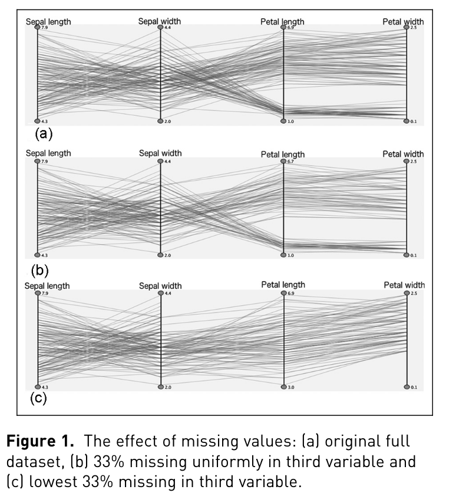
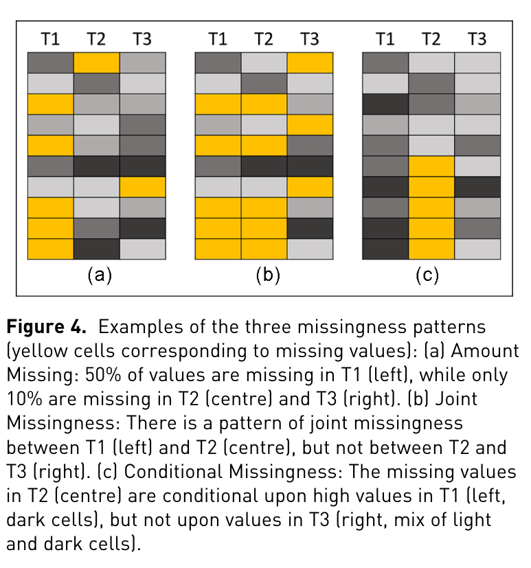

# Profiler: integrated statistical analysis and visualization for data quality assessment

1. is processed using javascript. This is SLOW when done at scale; 
    POSSIBLY FOR MY PROJECT I CAN MAKE AN OPTIMIZED VERSION OF THIS?
2. has relatively slow rendering times with large amounts of data and rows. 
    main bottleneck was rendering
3. data analysis tool
4. used to detect missing, erronous, extreme and invalid (key violation) data.
5. similar to Googles. "Google Refine" 
6. Visual analytic tools such as Tableau, GGobi, and Im-
    provise enable analysts to construct multi7.dimensional views
    of data. However, these tools generally require users to choose
    which variables to visualize. As the number of data subsets ex8.
    plodes combinatorially, analysts must often rely on significant do9.
    main expertise to identify variables that may contain or help explain
    anomalies.
7. columns have a "quality bar". like the one i see in Picard for music files

an optimization i could make is using precompiled c code API run in the browser using wasm Emscripten.
Then using d3 i can display this data.

--- 

# Visualization of missing data: a state-of-the-art survey

 - Laplacian Fill ?
 - Rank Fill algorithms
 - Modified Rank Fill algorithm
    - has been developed to handle cases where the missing data
        regions are too large for the Rank Fill Algorithm
    - This algorithm combines the output from the Rank Fill Algorithm
        with the Laplacian Fill Algorithm to fill the remaining areas
        of the missing data regions.
    - Honaker et al. [15] provides a full R package (Amelia II)
        for multiple imputations of missing values with a powerful
        and user-friendly approach to handling missing data, with a
        focus on speed, accuracy, and ease of use. 
 - R package naniar
 - MissiG visualization for missingness of data
 - THIS IS POSSIBLE FURTHER RESEARCH GIVEN BY PAPER
    - visualization for data imputation showing differences between 
        different imputation methods. 
        - Mean
        - Regression
        - kNN
        - Multiple imputation
        - Time-series interpolation
    - suppoting a variety of data types
        - networks, geometric, heterogeneious data

--- 

# Impute-VSS: A comprehensive web based visualization and simulation suite for comparative data imputation and statistical evaluation

- comprehensive data imputation suite 
- compared to alternatives. "AllinOne pre-processing", "Alteryx", "MDI Toolbox"
- kinda boring. just a frontend for scikit learn IMPUTE module it seems
- areas of improvement listed by author
    - use of deeplearning? maybe get ai to look at graph and draw conclusion
    - it is missing a few visualization methods. maybe can add to?

---

# To Explore What Isnt There: Glyph-Based Visualization for Analysis of Missing Values

- presents MissiG visualization method for missing values

How a single MissiG glyph works

Each glyph represents one variable.

(A) Amount Missing
- Light blue vertical block
- Height = percentage of missing values
- Full glyph height = 100%

(B) Distribution of recorded values
- Grey histogram on the left half
- Shows distribution of observed (non-missing) values
- This gives context: What does the variable look like when data is present?

(C) Joint Missingness (JM)
- Activated when a variable is selected
- Red block overlaid on other glyphs
- Height = % of records missing in both variables
- JM is non-directional (A missing with B = B missing with A)

(D) Conditional Missingness (CM)
- Red histogram on the right half
- Shows the distribution of recorded values conditioned on another variable being missing
- This is the most powerful part:
    - If red ≈ grey → missingness likely random
    - If red ≠ grey → missingness depends on values

---

# To identify what is not there a definition of missingness 
patterns and evaluation of missing value visualization

- usability evaluation

-  fig 1 good visualization to use.
    - effectively shows the change in distribution caused by missing values 
    

- "missing values may greatly distord the statistical properties of data, 
    such as mean and variances."
- "Twiddy" et al were among the first to address challenges related to visualization of missing data. 
- MANET software
- AmeliaView R package

- catagories of missing data
    -   Missing Completely at Random (MCAR)
    -   Missing at Random (MAR)
    -   Missing Not at Random (MNAR)

- describes "amount missing (AM)", "joint missingness" (JM), "conditional missingness" (CM).
    - 
    1. AM - approximately how much dat are missing in attribute X?
    2. JM - with which attribute does attribute X have the most jointly missing values?
    3. CM - which trend in which attribute is most likely to be accountable 
        for the missing data in attribute X?

- visualization methods
    - location
    - color
    - size
    - connection

    - marginplot matrix
    - matrix plot
    - parallel coordinates

- user study on methods effectivness for showing AM JM CM
    - best overall performance using matrix plot, 
        compared to marginplot matrix and parallel coordinates.
    - worse overall performance using marginplot matrix
    - matrix was better at showing JM than AM.
    - matrix showed identical performance for JM and CM 

---

# Exploring-incomplete-data-using-visualization-techniques.pdf

- made VIM!
- data set used to show missing data visualizations
    - Austrian EU-SILC public use data set from 2004
    - Kola C-horizon data 2008
    - Mammal sleep data. allison and cichetti 1976

